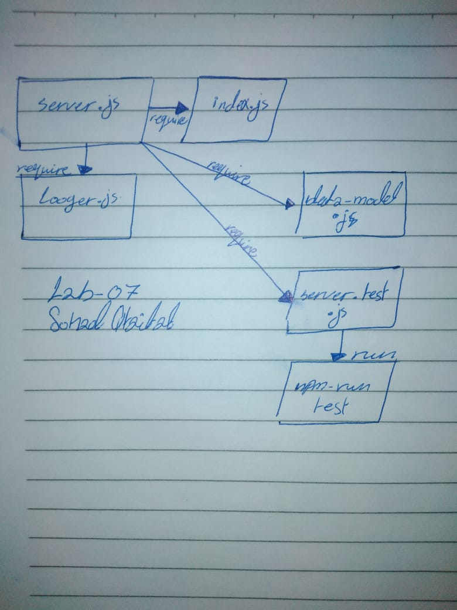

# Express
lab-07- Express :low_brightness: :hourglass:  :high_brightness:
# LAB - Class 07

## Express

### Author: Sohad Qtaitat

### Links and Resources

- [submission PR](https://github.com/401-advanced-javascript-sohad/lab-07-api-server/pull/1)
- [ci/cd](https://github.com/401-advanced-javascript-sohad/lab-07-api-server/actions)

### Setup

- `PORT` - 8080

#### How to initialize/run your application (where applicable)

-  `npm run start`
- `nodemon`

#### Tests

- How do you run tests? npm run test

#### UML

